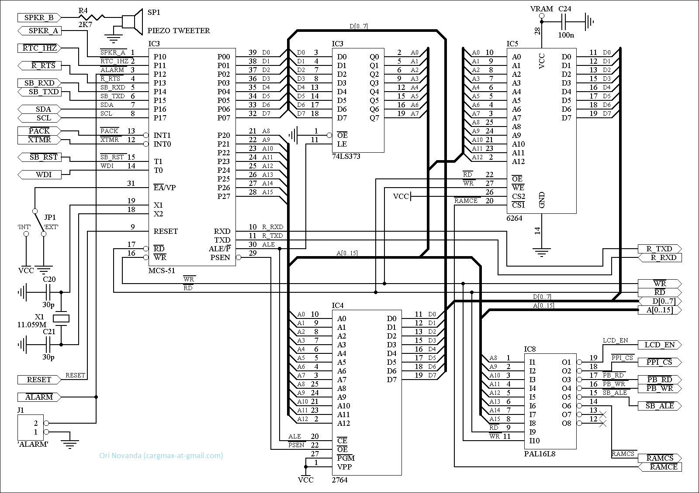
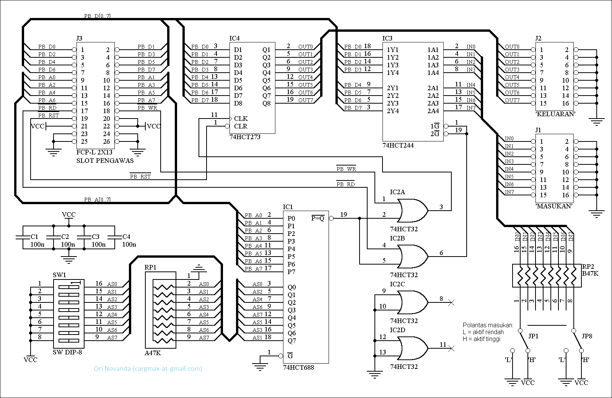
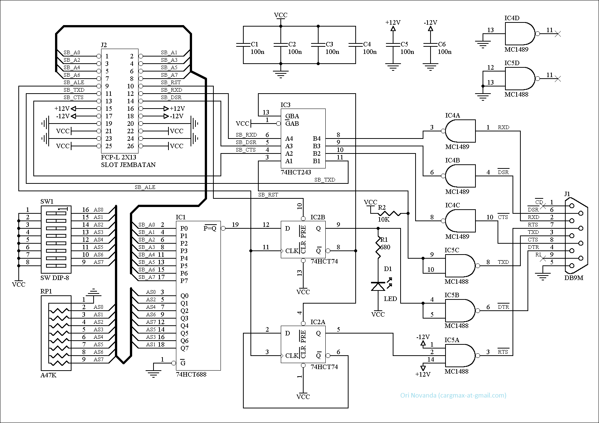
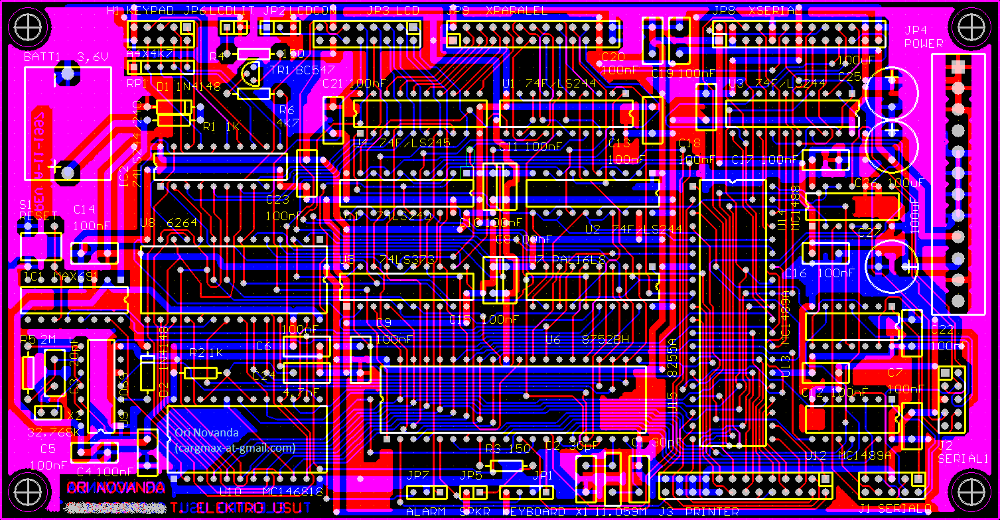
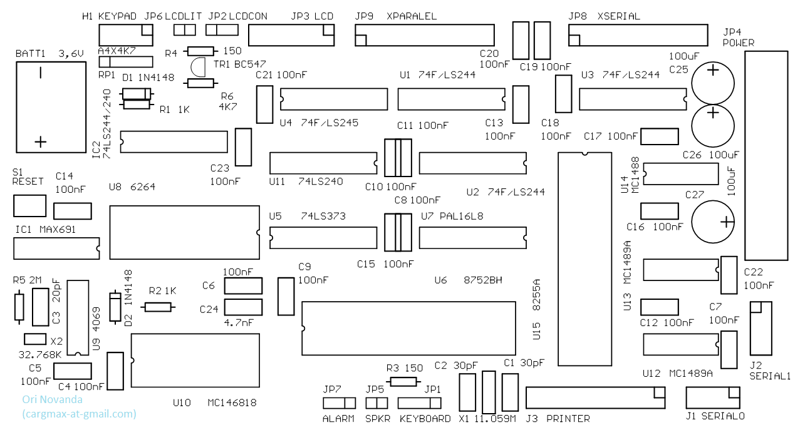
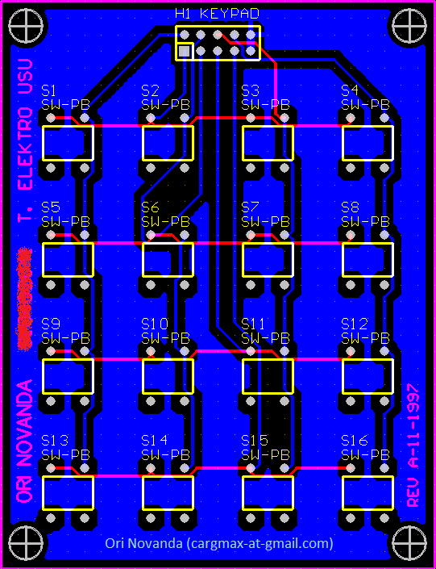
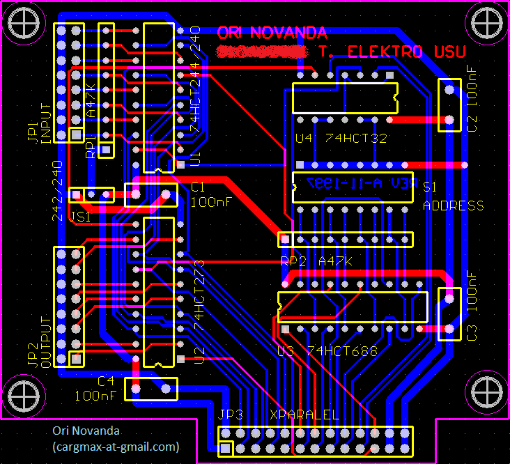
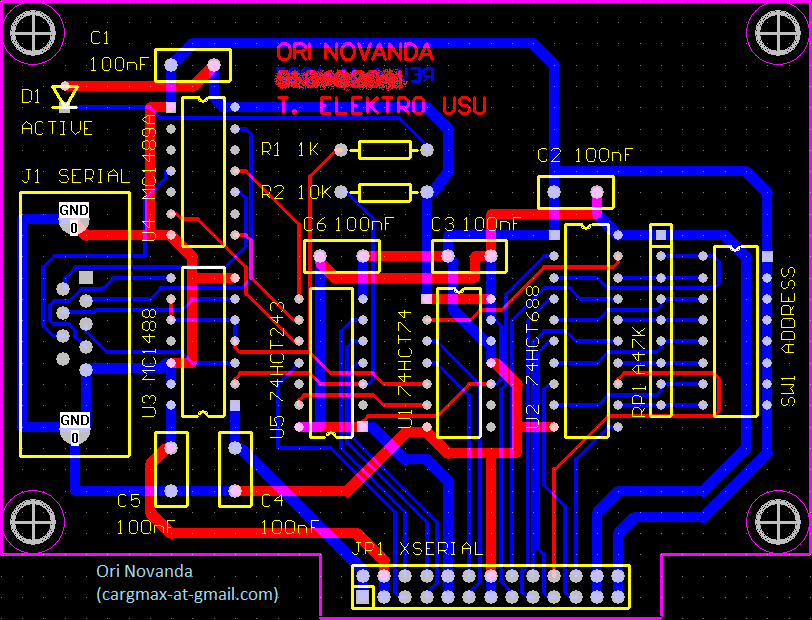

Supervisory Terminal ST-99
==========================

## A single board embedded computer for supervising multiple devices from a centralized location.

Contact: Ori Novanda (cargmax-at-gmail.com)

I designed and built this embedded system back in 1997-1999. I developed it for supervising multiple devices (from different vendors) from a central location.
The system used the Intel 8052 microcontroller as the main controller. I designed the PCB in two layers. I developed the firmware fully in assembly (MCS-51/52) and provided some hardware functionality through emulator firmware (e.g.  custom alarm sound, I2C bus, and secondary serial port) to save the bill of materials (BOM).

## Features:
*	Addressable I/O ports (expansion bus): to monitor up to 8-bit x 256 devices
*	Addressable slave serial ports (expansion bus): up to 256 RS-232 serial ports
*	Master serial port to communicate to a PC
*	Printer port to log events through an external printer
*	On-board Real Time Clock and Watchdog circuitry
*	Build-in LCD and keypad
*	Alarm sound

## Schematics:

### CPU

### Parallel Expansion Board

### Serial Expansion Board

## PCBs:

### Main Board

### Main Board Component Layout:

### Keypad Board

### Parallel Expansion Board

### Serial Expansion Board

